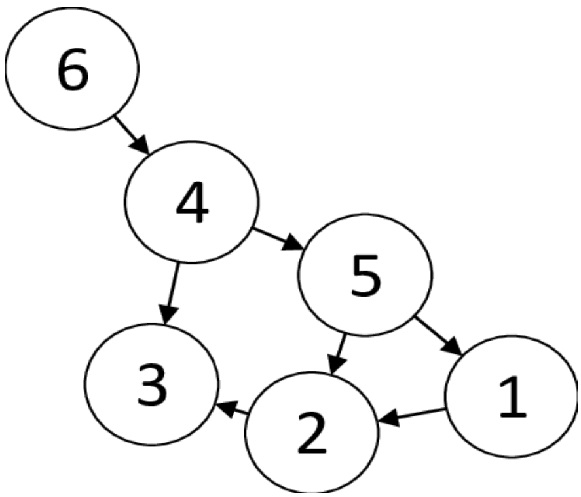

# OOP-Ex3
Fourth Assignment in OOP course in Python @Ariel University 2020

@author Jordan Perez & Nathanael Benichou

## Directed Weighted Graph
In this assignment we implemented a directed weighted graph with some algorithms to power it.

# Graph Structure
The graph represented by 3 dictionaries:
- __V: Dict[int, Node_data] for vertices
- __N_out: Dict[int, Dict[int, Edge_data]] for outgoing edges
- __N_in: Dict[int, Dict[int, Edge_data]] for incoming edges

Node_data is the class implementing vertices and Edge_data the class implementing edges

### Example: Let's build a graph

#### Creating 6 Nodes:
```
{
    for i in range(6):
        graph.add_node(i)
}
```
#### Creating some Edges:
```
{
    graph.add_edge(1, 2, 0)
    graph.add_edge(2, 3, 0)
    graph.add_edge(6, 4, 0)
    graph.add_edge(4, 3, 0)
    graph.add_edge(4, 5, 0)
    graph.add_edge(5, 2, 0)
    graph.add_edge(5, 1, 0)
}

```
### Given Graph:



# DiGraph class
| Method  | Description  |
| :--------------- |:-------------|
|.v_size(self) -> int:| Returns the number of vertices in the graph.|
|.e_size(self) -> int:| Returns the number of edges in the graph.|
|.get_mc(self) -> int:| Returns current version of graph.|
|.add_node(self, node_id: int, pos: tuple = None)| adds a vertex to the graph.|
|.add_edge(self, id1: int, id2: int, weight: float)| Adds an edge with a weight between two existing vertices.
|.remove_node(self, node_id: int) -> bool: | Removes a vertex with all its edges from the graph|
|.remove_edge(self, node_id1: int, node_id2: int) -> bool:| Remove an edge between two vertices|
|get_all_v(self) -> dict:| Returns all the vertices in graph|
|all_in_edges_of_node(self, id1: int) -> dict:| Returns all the incoming edges of a given vertex|
|all_out_edges_of_node(self, id1: int) -> dict:| Returns all the outgoing edges of a given vertex|
|get_node(self, node_id: int) -> Node_data:| Returns vertex with give key
|def __repr__(self):| Returns a String reprenting the graph|


# GraphAlgo class
| Method  | Description  |
| :--------------- |:-------------|
|.__init__(self, other=DiGraph()):| inits the graph|
|.load_from_json(self, file_name: str) -> bool:| Loads a graph from a .json file.|
|.save_to_json(self, file_name: str) -> bool:| Saves the graph in .json to a file|
|.shortest_path(self, id1: int, id2: int) -> (float, list):|Returns the shortest path from node src to node dst using Dijkstra's Algorithm|
|.connected_component(self, id1: int) -> list:|Finds the Strongly Connected Component(SCC) which node id1 is in|
|.connected_components(self) -> List[list]:|Finds all the Strongly Connected Component(SCC) in the graph.|
|.plot_graph(self) -> None:| Display the graph using matplotlib library

# Algorithms used:
```
Djikstra - used in shortest_path
Tarjan - used in connected_components
```